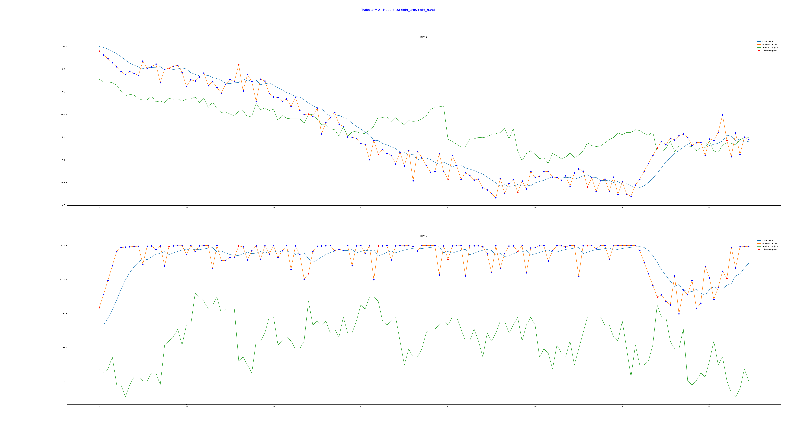

## Working with Unitree G1

Following the structure of Unitree’s official LeRobot dataset, the model uses the positions of upper body joints (including fingers) as input states and predicts `action_horizon = 16` steps of actions for the same set of joints.

A total of 28 joints will be used:

| Joint Name (`_mode_pr == 0`) | Joint Name (`_mode_pr == 1`) | LeRobot Dataset Key |
| ---------------------------- | ---------------------------- | ------------------- |
| L\_SHOULDER\_PITCH           | L\_SHOULDER\_PITCH           | kLeftShoulderPitch  |
| L\_SHOULDER\_ROLL            | L\_SHOULDER\_ROLL            | kLeftShoulderRoll   |
| L\_SHOULDER\_YAW             | L\_SHOULDER\_YAW             | kLeftShoulderYaw    |
| L\_ELBOW                     | L\_ELBOW                     | kLeftElbow          |
| L\_WRIST\_ROLL               | L\_WRIST\_ROLL               | kLeftWristRoll      |
| L\_WRIST\_PITCH              | L\_WRIST\_PITCH              | kLeftWristPitch     |
| L\_WRIST\_YAW                | L\_WRIST\_YAW                | kLeftWristYaw       |
| R\_SHOULDER\_PITCH           | R\_SHOULDER\_PITCH           | kRightShoulderPitch |
| R\_SHOULDER\_ROLL            | R\_SHOULDER\_ROLL            | kRightShoulderRoll  |
| R\_SHOULDER\_YAW             | R\_SHOULDER\_YAW             | kRightShoulderYaw   |
| R\_ELBOW                     | R\_ELBOW                     | kRightElbow         |
| R\_WRIST\_ROLL               | R\_WRIST\_ROLL               | kRightWristRoll     |
| R\_WRIST\_PITCH              | R\_WRIST\_PITCH              | kRightWristPitch    |
| R\_WRIST\_YAW                | R\_WRIST\_YAW                | kRightWristYaw      |
| thumb\_0                     | Dex3-1 Joint Motor Order     | kLeftHandThumb0     |
| thumb\_1                     | Dex3-1 Joint Motor Order     | kLeftHandThumb1     |
| thumb\_2                     | Dex3-1 Joint Motor Order     | kLeftHandThumb2     |
| middle\_0                    | Dex3-1 Joint Motor Order     | kLeftHandMiddle0    |
| middle\_1                    | Dex3-1 Joint Motor Order     | kLeftHandMiddle1    |
| index\_0                     | Dex3-1 Joint Motor Order     | kLeftHandIndex0     |
| index\_1                     | Dex3-1 Joint Motor Order     | kLeftHandIndex1     |
| thumb\_0                     | Dex3-1 Joint Motor Order     | kRightHandThumb0    |
| thumb\_1                     | Dex3-1 Joint Motor Order     | kRightHandThumb1    |
| thumb\_2                     | Dex3-1 Joint Motor Order     | kRightHandThumb2    |
| middle\_0                    | Dex3-1 Joint Motor Order     | kRightHandMiddle0   |
| middle\_1                    | Dex3-1 Joint Motor Order     | kRightHandMiddle1   |
| index\_0                     | Dex3-1 Joint Motor Order     | kRightHandIndex0    |
| index\_1                     | Dex3-1 Joint Motor Order     | kRightHandIndex1    |

---

### Model Inputs

* **Video Frame**: A 224×224 RGB image.
* **Language Instruction**: A string instruction.
* **Robot State (Joint Positions)**: A 1D floating-point tensor of size `(1, max_state_dim)`. Default `max_state_dim = 64`. If fewer joints are used, the remaining positions will be zero-padded.

For Unitree G1, each joint position is a single floating-point value extracted from `unitree_hg::msg::dds_::MotorState_.q`, as shown in the [teleoperation toolkit](https://github.com/unitreerobotics/avp_teleoperate/blob/728ffa0f9ff309e52f5cfbc16fea5e5c0e146785/teleop/teleop_hand_and_arm.py#L193-L197):

| LeRobot Dataset Key | Size |
| ------------------- | ---- |
| kLeftShoulderPitch  | (1,) |
| kLeftShoulderRoll   | (1,) |
| kLeftShoulderYaw    | (1,) |
| kLeftElbow          | (1,) |
| kLeftWristRoll      | (1,) |
| kLeftWristPitch     | (1,) |
| kLeftWristYaw       | (1,) |
| kRightShoulderPitch | (1,) |
| kRightShoulderRoll  | (1,) |
| kRightShoulderYaw   | (1,) |
| kRightElbow         | (1,) |
| kRightWristRoll     | (1,) |
| kRightWristPitch    | (1,) |
| kRightWristYaw      | (1,) |
| kLeftHandThumb0     | (1,) |
| kLeftHandThumb1     | (1,) |
| kLeftHandThumb2     | (1,) |
| kLeftHandMiddle0    | (1,) |
| kLeftHandMiddle1    | (1,) |
| kLeftHandIndex0     | (1,) |
| kLeftHandIndex1     | (1,) |
| kRightHandThumb0    | (1,) |
| kRightHandThumb1    | (1,) |
| kRightHandThumb2    | (1,) |
| kRightHandMiddle0   | (1,) |
| kRightHandMiddle1   | (1,) |
| kRightHandIndex0    | (1,) |
| kRightHandIndex1    | (1,) |

---

### Output Actions

The GR00T N1 model outputs a tensor of shape `(action_horizon, action_dim=32)`. For the G1, the first 28 columns are populated with predicted actions. The remaining columns are filled with zeros.

Each row corresponds to a time step and is decoded/unnormalized into a floating-point vector to control the joint positions for that step.

| LeRobot Dataset Key | Size  |
| ------------------- | ----- |
| kLeftShoulderPitch  | (16,) |
| kLeftShoulderRoll   | (16,) |
| kLeftShoulderYaw    | (16,) |
| kLeftElbow          | (16,) |
| kLeftWristRoll      | (16,) |
| kLeftWristPitch     | (16,) |
| kLeftWristYaw       | (16,) |
| kRightShoulderPitch | (16,) |
| kRightShoulderRoll  | (16,) |
| kRightShoulderYaw   | (16,) |
| kRightElbow         | (16,) |
| kRightWristRoll     | (16,) |
| kRightWristPitch    | (16,) |
| kRightWristYaw      | (16,) |
| kLeftHandThumb0     | (16,) |
| kLeftHandThumb1     | (16,) |
| kLeftHandThumb2     | (16,) |
| kLeftHandMiddle0    | (16,) |
| kLeftHandMiddle1    | (16,) |
| kLeftHandIndex0     | (16,) |
| kLeftHandIndex1     | (16,) |
| kRightHandThumb0    | (16,) |
| kRightHandThumb1    | (16,) |
| kRightHandThumb2    | (16,) |
| kRightHandMiddle0   | (16,) |
| kRightHandMiddle1   | (16,) |
| kRightHandIndex0    | (16,) |
| kRightHandIndex1    | (16,) |

---

### Inference Loop

The plot above shows 160 predicted steps from GR00T N1.

* **X-axis**: Time steps
* **Y-axis**: Normalized joint position
* **Red dots**: Inference steps
* **Blue dots**: Predicted actions (15 per inference)

Assuming a 10 Hz inference frequency, 160 steps correspond to 1 seconds of action. Inference occurs every `action_horizon = 16` steps, meaning a new prediction is only made once the previous predictions have been executed.

---

### Data Collection

* https://github.com/unitreerobotics/avp_teleoperate
* https://github.com/unitreerobotics/unitree_IL_lerobot

---

### Finetune

---

### On-Device Deployment

Several options are available for deploying models on the G1’s Jetson AGX Orin:

* Use PyTorch directly with the inference service in this repo.
* Convert the PyTorch model to ONNX and use ONNX Runtime.
* Convert the PyTorch model to TensorRT for optimized performance.

---

### References

* [Unitree Robotics G1 Camera Packaging Dataset](https://huggingface.co/datasets/unitreerobotics/G1_CameraPackaging_Dataset)
* [Unitree Robotics G1 Toasted Bread Dataset](https://huggingface.co/datasets/unitreerobotics/G1_ToastedBread_Dataset)
* [Hand state & action source code](https://github.com/unitreerobotics/avp_teleoperate/blob/main/teleop/robot_control/robot_hand_unitree.py#L193-L197)
* [Dexterous hand documentation](https://support.unitree.com/home/en/G1_developer/dexterous_hand)
* [Jetson environment setup and model inference guide](https://docs.ultralytics.com/guides/nvidia-jetson/#flash-jetpack-to-nvidia-jetson)
* [NVIDIA Jetson PyTorch installation guide](https://docs.nvidia.com/deeplearning/frameworks/install-pytorch-jetson-platform/index.html)

